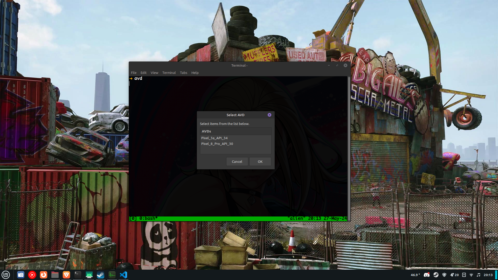

# AVD

Launch an Android Virtual Device (AVD) from the command line.

## Installation

Place the `avd` script in your path.

## Usage

```bash
avd
```


## Requirements

- Android SDK
- Android Virtual Device
- Zenity

## License

MIT

## Preview

